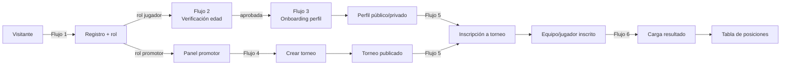

# User Flows — PRO (MVP1)

> Flujos de usuario del MVP1 mapeados 1:1 a las 6 HU (ver `tasks/plan-desarrollo.md` y `tasks/hu/HU-00X.md`). Cada flujo enumera: trigger, pasos, estados de error y pantallas involucradas, con referencia al RF y HU que implementa. Wireframes base por pantalla en `design/wireframes/`.
>
> Estado: **G2 en curso** (`tasks/current-gate.txt` = `2`). Complementa `tasks/gate-status.md`.

## Índice

1. [Flujo 1 — Registro con rol (jugador / promotor)](#flujo-1--registro-con-rol-jugador--promotor) — HU-001 / RF-001
2. [Flujo 2 — Verificación de edad del jugador](#flujo-2--verificación-de-edad-del-jugador) — HU-002 / RF-007
3. [Flujo 3 — Onboarding del perfil tipo ficha con visibilidad por campo](#flujo-3--onboarding-del-perfil-tipo-ficha-con-visibilidad-por-campo) — HU-003 / RF-002
4. [Flujo 4 — Creación y publicación de torneo (promotor)](#flujo-4--creación-y-publicación-de-torneo-promotor) — HU-004 / RF-003
5. [Flujo 5 — Inscripción de equipo / jugador a torneo](#flujo-5--inscripción-de-equipo--jugador-a-torneo) — HU-005 / RF-004
6. [Flujo 6 — Carga de resultados y tabla de posiciones](#flujo-6--carga-de-resultados-y-tabla-de-posiciones) — HU-006 / RF-005

## Mapa global de flujos



---

## Flujo 1 — Registro con rol (jugador / promotor)

- **HU:** [HU-001](../tasks/hu/HU-001.md) — **RF:** RF-001.
- **Trigger:** visitante sin cuenta pulsa "Crear cuenta" en la landing o en cualquier CTA protegido.
- **Pasos:**
  1. El visitante abre `/register` y completa email + contraseña + confirmación.
  2. Selecciona rol: `jugador`, `promotor` o ambos (checkbox múltiple).
  3. Acepta términos y tratamiento de datos.
  4. Envía el formulario.
  5. El sistema crea la cuenta, asigna el/los rol(es) y envía (opcional MVP1) correo de verificación.
  6. Redirección condicional por rol principal:
     - si incluye `jugador` → Flujo 2 (verificación de edad) antes de habilitar el perfil.
     - si sólo `promotor` → panel de promotor con acceso directo al Flujo 4.
- **Estados de error:**
  - Email ya registrado → mensaje en campo email con CTA "iniciar sesión".
  - Contraseña débil (reglas definidas en G3 ADR-004) → mensaje por regla no cumplida.
  - Rol no seleccionado → error de campo.
  - Fallo de red / 5xx del servidor → toast de error con reintento.
- **Pantallas involucradas:** `landing`, `register`, `verify-email` (opcional MVP1).
- **Wireframes:** [`01-register.md`](./wireframes/01-register.md).

```mermaid
flowchart TD
  A[Landing / CTA protegido] --> B[/register: formulario]
  B --> C{Datos válidos?}
  C -- No --> B
  C -- Sí --> D[Crear cuenta + rol(es)]
  D --> E{Rol incluye jugador?}
  E -- Sí --> F[Flujo 2: verificación edad]
  E -- No --> G[Panel promotor]
```

---

## Flujo 2 — Verificación de edad del jugador

- **HU:** [HU-002](../tasks/hu/HU-002.md) — **RF:** RF-007.
- **Trigger:** jugador recién registrado o jugador con verificación `pendiente`/`rechazada` que intenta una acción bloqueada.
- **Pasos:**
  1. El jugador entra en `/verification/age` y ve el estado actual (`pendiente` / `aprobada` / `rechazada`).
  2. Si `pendiente` sin documento cargado, sube documento de identidad (JPG/PNG/PDF, tamaño máximo definido).
  3. El sistema almacena el documento en bucket privado y marca la solicitud como `pendiente de revisión`.
  4. El backoffice (o integración externa según `ADR-003`) revisa y resuelve la solicitud.
  5. En caso de aprobación: el perfil se desbloquea y se habilita la inscripción a torneos. Notificación in-app / email.
  6. En caso de rechazo o menor de edad: el sistema informa motivo y mantiene el perfil bloqueado; el jugador puede subir un nuevo documento si corresponde.
- **Estados de error:**
  - Archivo con tipo/tamaño no soportado → error en el uploader antes de llamar al backend.
  - Falla de almacenamiento → toast de error con reintento.
  - Intento de acceder al documento por un tercero → 403 (el documento nunca se sirve a audiencias externas).
- **Pantallas involucradas:** `verification/age` (upload + estado), banner persistente en perfil mientras no esté `aprobada`.
- **Wireframes:** [`02-age-verification.md`](./wireframes/02-age-verification.md).

```mermaid
flowchart TD
  A[Jugador post-registro] --> B[/verification/age]
  B --> C{Doc cargado?}
  C -- No --> D[Subir documento]
  D --> E[Estado: pendiente revisión]
  C -- Sí --> E
  E --> F{Resolución}
  F -- aprobada --> G[Perfil desbloqueado]
  F -- rechazada --> H[Mensaje motivo + reintentar]
  F -- menor edad --> I[Bloqueado MVP1]
```

---

## Flujo 3 — Onboarding del perfil tipo ficha con visibilidad por campo

- **HU:** [HU-003](../tasks/hu/HU-003.md) — **RF:** RF-002.
- **Trigger:** jugador con verificación de edad `aprobada` accede por primera vez a `/profile/edit` o a cualquier feature que exige perfil completo (ej. inscripción a torneo).
- **Pasos:**
  1. El sistema muestra el perfil organizado en **4 bloques** (Identidad, Morfológico/Biométrico, Capacidades Condicionales, Destrezas Técnicas) con el subconjunto MVP1 (fútbol).
  2. El jugador completa primero el núcleo obligatorio: nombre, edad (derivada de verificación), ubicación, disciplina `fútbol`, lateralidad, posición preferida, pie hábil.
  3. Puede completar campos opcionales (estatura, peso, intereses, habilidades blandas — descripción libre + tags curados) o dejarlos vacíos.
  4. Cada campo expone un **selector de visibilidad** (`público` / `promotores` / `privado`) con default sensible por bloque (morfológicos en `promotores`; documento y stats sensibles en `privado`).
  5. Se guarda automáticamente por bloque o al pulsar "Guardar" (patrón a definir en wireframes/UX).
  6. El jugador puede abrir "Previsualizar como…" para ver su perfil tal como lo ven un visitante `público` o un `promotor`.
  7. Desde "Mi perfil público" (`/u/:slug`) puede compartir el enlace.
- **Estados de error:**
  - Campos del núcleo incompletos al intentar completar onboarding → el sistema bloquea avance con mensaje por campo.
  - Descripción libre de habilidades blandas fuera de rango (< mínimo / > máximo de chars) → error por campo.
  - Tag no perteneciente al catálogo cerrado → rechazo con mensaje.
  - Intento de elevar `documento de identidad` desde `privado` → no permitido por UI ni por API.
- **Pantallas involucradas:** `profile/edit`, `profile/edit/preview`, `/u/:slug` (vista pública), banner de verificación (si aplica).
- **Wireframes:** [`03-profile-edit.md`](./wireframes/03-profile-edit.md), [`04-profile-public-view.md`](./wireframes/04-profile-public-view.md).

```mermaid
flowchart TD
  A[Jugador verificado] --> B[/profile/edit]
  B --> C[Bloque 1 Identidad]
  C --> D[Bloque 2 Morfológico]
  D --> E[Bloque 3 Capacidades]
  E --> F[Bloque 4 Destrezas MVP1 fútbol]
  F --> G[Selector visibilidad por campo]
  G --> H[Previsualizar como…]
  H --> I[/u/:slug perfil público]
```

---

## Flujo 4 — Creación y publicación de torneo (promotor)

- **HU:** [HU-004](../tasks/hu/HU-004.md) — **RF:** RF-003.
- **Trigger:** promotor autenticado pulsa "Nuevo torneo" en su panel.
- **Pasos:**
  1. El promotor entra a `/tournaments/new` (asistente multi-step).
  2. Paso 1: datos básicos (nombre, formato, cupos, ubicación, fechas, categorías).
  3. Paso 2: reglas y categorías (edad +18 obligatorio, formato partido, criterios de desempate, etc.).
  4. Paso 3: revisión y publicación — opción "Guardar borrador" o "Publicar".
  5. Al publicar, el torneo aparece en el listado público `/tournaments` y queda abierto a inscripciones.
  6. El promotor puede editar desde `/tournaments/:id/edit`. Cambios estructurales tras inscritos requieren confirmación y notifican a los equipos.
- **Estados de error:**
  - Datos mínimos incompletos → error por campo.
  - Fecha de inicio en el pasado → error.
  - Cupos a la baja tras tener inscritos más allá del nuevo límite → bloqueo.
  - Usuario sin rol promotor intenta acceder → 403 con mensaje.
- **Pantallas involucradas:** `tournaments/mine` (panel promotor), `tournaments/new` (asistente), `tournaments/:id` (detalle), `tournaments/:id/edit`.
- **Wireframes:** [`05-tournament-list.md`](./wireframes/05-tournament-list.md), [`06-tournament-create.md`](./wireframes/06-tournament-create.md), [`07-tournament-detail.md`](./wireframes/07-tournament-detail.md).

```mermaid
flowchart TD
  A[Promotor autenticado] --> B[/tournaments/mine]
  B --> C[/tournaments/new]
  C --> D[Paso 1: básicos]
  D --> E[Paso 2: reglas]
  E --> F[Paso 3: revisión]
  F --> G{Acción}
  G -- borrador --> H[Estado: borrador]
  G -- publicar --> I[Estado: abierto a inscripciones]
  I --> J[/tournaments público]
```

---

## Flujo 5 — Inscripción de equipo / jugador a torneo

- **HU:** [HU-005](../tasks/hu/HU-005.md) — **RF:** RF-004. **Dependencias:** HU-002, HU-003, HU-004.
- **Trigger:** jugador/capitán pulsa "Inscribirme" / "Inscribir a mi equipo" en la ficha pública del torneo.
- **Pasos:**
  1. El capitán (o jugador individual si el formato lo permite) entra a `/tournaments/:id/register`.
  2. Selecciona el equipo (si es capitán de varios) o confirma modo individual.
  3. El sistema verifica automáticamente por cada miembro: perfil completo y verificación de edad `aprobada`.
  4. Si algún miembro falla, la UI lista los bloqueos específicos (nombre + motivo) y ofrece CTAs para resolver (abrir `verification/age`, completar perfil) o remover al miembro.
  5. Confirma la inscripción y el sistema descuenta un cupo (si aplica).
  6. El promotor recibe notificación de la nueva inscripción.
- **Estados de error:**
  - Torneo no `abierto a inscripciones` → bloqueo con mensaje.
  - Cupos agotados → oferta de lista de espera si el torneo la permite.
  - Inscripción duplicada (mismo equipo/jugador ya inscrito) → bloqueo.
  - Miembros del equipo no verificados → bloqueo con desglose por miembro.
  - Categoría incompatible con la edad del jugador → bloqueo.
- **Pantallas involucradas:** `tournaments/:id` (detalle), `tournaments/:id/register` (flujo), `tournaments/:id/registrations` (vista promotor).
- **Wireframes:** [`08-tournament-registration.md`](./wireframes/08-tournament-registration.md).

```mermaid
flowchart TD
  A[Capitán / jugador] --> B[/tournaments/:id/register]
  B --> C{Formato}
  C -- equipo --> D[Selecciona equipo]
  C -- individual --> E[Modo individual]
  D --> F[Validación por miembro]
  E --> F
  F --> G{Todos ok?}
  G -- No --> H[Lista bloqueos + resolver]
  G -- Sí --> I[Confirmar inscripción]
  I --> J{Cupo disponible?}
  J -- Sí --> K[Inscripción confirmada]
  J -- No --> L[Lista de espera o rechazo]
```

---

## Flujo 6 — Carga de resultados y tabla de posiciones

- **HU:** [HU-006](../tasks/hu/HU-006.md) — **RF:** RF-005.
- **Trigger:** promotor dueño del torneo abre la vista de gestión de partidos con al menos un partido pendiente.
- **Pasos:**
  1. El promotor entra a `/tournaments/:id/matches` y ve el fixture generado/ingresado.
  2. Selecciona un partido pendiente y pulsa "Cargar resultado".
  3. Ingresa marcador final (goles local / goles visitante) y, opcional MVP1, goleadores.
  4. Confirma. El sistema persiste el resultado, recalcula la tabla de posiciones y suma stats a los perfiles de los jugadores implicados (respetando visibilidad).
  5. La ficha pública `/tournaments/:id` muestra resultado + tabla actualizada en la siguiente consulta.
  6. Dentro de una ventana de corrección configurable (p. ej. 24 h), el promotor puede editar el resultado; el sistema registra evento de auditoría y recalcula.
- **Estados de error:**
  - Marcador con formato inválido → error por campo.
  - Partido fuera de ventana de corrección → edición bloqueada; se permite pedir revisión al soporte (candidato post-MVP).
  - Acción por usuario no dueño del torneo → 403.
- **Pantallas involucradas:** `tournaments/:id/matches` (gestión), `tournaments/:id/standings` (tabla pública), `tournaments/:id` (detalle con tabla embebida).
- **Wireframes:** [`09-match-results-entry.md`](./wireframes/09-match-results-entry.md), [`10-standings-table.md`](./wireframes/10-standings-table.md).

```mermaid
flowchart TD
  A[Promotor] --> B[/tournaments/:id/matches]
  B --> C[Seleccionar partido pendiente]
  C --> D[Ingresar marcador + goleadores]
  D --> E[Confirmar]
  E --> F[Recalcular tabla]
  F --> G[/tournaments/:id/standings]
  F --> H[Stats reflejadas en perfil]
```

---

## Cobertura RF → flujo → HU

| RF | Flujo | HU |
|----|-------|----|
| RF-001 | Flujo 1 — Registro con rol | HU-001 |
| RF-002 | Flujo 3 — Onboarding del perfil | HU-003 |
| RF-003 | Flujo 4 — Creación / publicación de torneo | HU-004 |
| RF-004 | Flujo 5 — Inscripción a torneo | HU-005 |
| RF-005 | Flujo 6 — Resultados + tabla | HU-006 |
| RF-007 | Flujo 2 — Verificación de edad | HU-002 |

## Pendientes para Gate 2

- [ ] Wireframes de baja fidelidad por cada pantalla en `design/wireframes/`.
- [ ] Catálogo preliminar de componentes reutilizables (shadcn/ui) derivado de los wireframes.
- [ ] Definir UX del selector de visibilidad por campo (propuesta inicial: agrupado por bloque con override por campo).
- [ ] Revisión y aprobación del fundador para cerrar G2.
