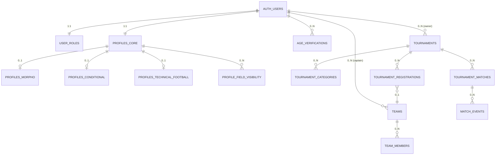

# Modelo de datos — PRO MVP1

> Modelo lógico objetivo para el MVP1 (6 RF). Formato: tabla por entidad, constraint clave, índices, notas de RLS y relación con el esquema v0 existente (`apps/web/supabase/migrations/*`). La implementación SQL se entrega por sprint en G4.

## 0. Convenciones

- Motor: **Postgres 15+ (Supabase managed)**; todas las tablas bajo el schema `public`.
- PKs `uuid` con `gen_random_uuid()` salvo PKs compuestas.
- Timestamps `timestamptz not null default now()` con columnas `created_at` y `updated_at`.
- `updated_at` mantenido por trigger común (`public.set_updated_at()`).
- **RLS obligatoria** en toda tabla nueva de este documento: `alter table … enable row level security;` + policies por operación.
- Enums y catálogos reutilizan los existentes donde aplica (`public.sports`).

## 1. Mapa RF → tablas MVP1

| RF | HU | Tablas principales |
|----|----|---------------------|
| RF-001 Registro con rol | HU-001 | `auth.users` (Supabase), `public.user_roles` |
| RF-007 Verificación edad | HU-002 | `public.age_verifications` |
| RF-002 Perfil tipo ficha | HU-003 | `public.profiles_core`, `public.profiles_morpho`, `public.profiles_conditional`, `public.profiles_technical_football`, `public.profile_field_visibility`, `public.skill_tags` |
| RF-003 Crear torneo | HU-004 | `public.tournaments`, `public.tournament_categories` |
| RF-004 Inscripción | HU-005 | `public.teams`, `public.team_members`, `public.tournament_registrations` |
| RF-005 Resultados + tabla | HU-006 | `public.tournament_matches`, `public.match_events`, **`public.standings` (vista materializada)** |

El esquema v0 (`public.profiles`, `public.matches`, `public.match_participants`, `public.ratings`, `public.messages`) coexiste durante la transición; ver `architecture/solution-architecture.md` §7.

## 2. Diagrama de entidades (alto nivel)

## 3. Entidades

### 3.1 `user_roles`
- **Propósito:** rol dual jugador/promotor (RF-001). Un usuario puede tener ambos.
- **Columnas:**
  - `user_id uuid pk references auth.users on delete cascade`
  - `is_player boolean not null default false`
  - `is_promoter boolean not null default false`
  - `created_at`, `updated_at`
- **Check:** `check (is_player or is_promoter)` — al menos un rol.
- **RLS:**
  - `select`: dueño (`user_id = auth.uid()`) + cualquier autenticado lee sólo para exhibir badge público (subset sin columnas sensibles — se expone vía vista).
  - `update`: sólo dueño.

### 3.2 `age_verifications`
- **Propósito:** RF-007 — evidencia del trámite; **nunca expone el documento al cliente**.
- **Columnas:**
  - `id uuid pk`
  - `user_id uuid not null references auth.users on delete cascade`
  - `status public.age_verification_status not null default 'pendiente'`
  - `storage_path text` — ruta dentro del bucket privado `age-verifications/`.
  - `mime_type text check (mime_type in ('image/jpeg','image/png','application/pdf'))`
  - `file_size_bytes int check (file_size_bytes <= 5 * 1024 * 1024)`
  - `uploaded_at timestamptz`
  - `reviewed_at timestamptz`, `reviewed_by uuid references auth.users`, `review_notes text`
  - `rejection_reason text`
  - `created_at`, `updated_at`
- **Enum:** `create type public.age_verification_status as enum ('pendiente','aprobada','rechazada','menor_edad');`
- **Constraint:** al menos una fila `aprobada` permite habilitar RF-002 / RF-004.
- **Índices:** `(user_id, status)`, `(status)` para cola de admin.
- **RLS:**
  - `select`: `user_id = auth.uid()` **o** rol admin (`service_role`).
  - `insert`: `user_id = auth.uid()` **y** `status = 'pendiente'`.
  - `update`: sólo `service_role` (admin aprueba/rechaza).
  - `delete`: nunca desde cliente.
- **Storage:** bucket `age-verifications` con policy que sólo permite a `service_role` generar URLs firmadas; ver ADR-003.

### 3.3 `profiles_core`
- **Propósito:** Bloque 1 — Identidad (RF-002).
- **Columnas:**
  - `user_id uuid pk references auth.users on delete cascade`
  - `full_name text not null`
  - `birth_date date not null check (birth_date <= current_date)` — derivada desde RF-007; edad calculada vía función.
  - `city text not null`, `region text`, `country text not null default 'CO'`
  - `primary_sport_id text not null references public.sports(id) default 'futbol'`
  - `interests text[] not null default '{}'` — tags libres (ver wireframe 03).
  - `soft_skills_text text check (char_length(soft_skills_text) between 0 and 1000)`
  - `soft_skills_tags text[] not null default '{}'` — subset de `public.skill_tags`.
  - `slug text unique not null` — usado en `/u/:slug` (vista pública).
  - `created_at`, `updated_at`
- **Constraint edad:** vista/función `public.age_years(birth_date)` usada en UI; **MVP1 bloquea guardar si edad < 18**.
- **Índices:** `(city, primary_sport_id)`, `(slug)`.
- **RLS:**
  - `select`: combinación de `auth.uid() = user_id` **OR** (campo público AND visibilidad == `público` en `profile_field_visibility`) — ver ADR-002 para la implementación operativa por vista.
  - `insert/update`: sólo dueño.

### 3.4 `profiles_morpho`
- **Propósito:** Bloque 2 — Morfológico/Biométrico.
- **Columnas:**
  - `user_id uuid pk references auth.users on delete cascade`
  - `height_m numeric(3,2) check (height_m between 1.00 and 2.50)`
  - `weight_kg numeric(5,2) check (weight_kg between 30.00 and 200.00)`
  - `wingspan_m numeric(3,2)`
  - `laterality public.laterality` — enum `(diestro|zurdo|ambos)`.
  - `somatotype public.somatotype` — enum `(ectomorfo|mesomorfo|endomorfo|mixto)`.
  - `created_at`, `updated_at`
- **RLS:** igual a `profiles_core` pero con defaults de visibilidad = `promotores` (ver ADR-002).

### 3.5 `profiles_conditional`
- **Propósito:** Bloque 3 — Capacidades condicionales.
- **Columnas:**
  - `user_id uuid pk references auth.users on delete cascade`
  - `strength_tags text[] not null default '{}'`, `strength_notes text`
  - `speed_tags text[] not null default '{}'`, `speed_notes text`
  - `endurance_tags text[] not null default '{}'`, `endurance_notes text`
  - `flexibility_tags text[] not null default '{}'`, `flexibility_notes text`
  - `created_at`, `updated_at`
- **Tags:** todos provienen de `public.skill_tags(category)` con `category in ('strength','speed','endurance','flexibility')`.
- **RLS:** default visibilidad `público` (configurable).

### 3.6 `profiles_technical_football` (Bloque 4, específico por deporte)
- **Propósito:** Destrezas técnicas para `primary_sport_id = 'futbol'`. Ver ADR-001 para fundamento de este patrón "tabla satélite por deporte" en MVP1.
- **Columnas:**
  - `user_id uuid pk references auth.users on delete cascade`
  - `position public.football_position not null` — enum `(arquero|defensa|mediocampista|delantero)`.
  - `dominant_foot public.dominant_foot not null` — enum `(derecho|izquierdo|ambos)`.
  - `performance_notes text check (char_length(performance_notes) between 0 and 1000)`
  - `tactical_role_notes text`
  - `created_at`, `updated_at`
- **Stats derivadas (no columnas, vista):** `profiles_football_stats` agrega datos de RF-005 (partidos jugados, goles, tarjetas) leyendo `match_events`.

### 3.7 `profile_field_visibility`
- **Propósito:** materialización del selector de visibilidad por campo (principio transversal). Ver ADR-002 para tradeoffs vs columnas enum inline.
- **Columnas:**
  - `user_id uuid references auth.users on delete cascade`
  - `field_key text not null` — clave canónica, ej. `'morpho.height_m'`, `'identity.city'`.
  - `level public.visibility_level not null default 'público'` — enum `(público|promotores|privado)`.
  - PK compuesta `(user_id, field_key)`.
  - `created_at`, `updated_at`
- **Defaults sensibles** (insertados por trigger al completar cada bloque):
  - Identidad núcleo → `público`.
  - Morfológicos y somatotipo → `promotores`.
  - Intereses / habilidades blandas → `público`.
  - Capacidades condicionales → `público`.
  - Destrezas técnicas → `público`.
- **Regla de integridad:** no se admite `field_key` que no existe en el catálogo `public.visibility_fields(field_key)` (seed obligatorio por migración).
- **Regla de seguridad:** nunca permite bajar el documento de identidad a `privado` + bloqueo total para promotor — en realidad el documento **no tiene entrada** en esta tabla y se gestiona sólo por `age_verifications`.
- **RLS:** dueño lee/escribe su propia fila; cualquiera lee sólo vía vistas agregadas (no acceso directo al detalle a terceros).

### 3.8 `skill_tags`
- **Propósito:** catálogo curado de tags (habilidades blandas + capacidades).
- **Columnas:** `id text pk`, `category text not null check (category in ('soft','strength','speed','endurance','flexibility'))`, `label text not null`, `active boolean default true`.
- **RLS:** lectura pública; escritura sólo `service_role`.

### 3.9 `tournaments`
- **Propósito:** torneos creados por promotores (RF-003).
- **Columnas:**
  - `id uuid pk default gen_random_uuid()`
  - `owner_id uuid not null references auth.users on delete restrict`
  - `title text not null`, `description text`
  - `sport_id text not null references public.sports(id) default 'futbol'`
  - `format public.tournament_format not null` — enum `(liga|eliminacion|grupos+eliminacion)`.
  - `modality public.tournament_modality not null` — enum `(equipos|individual)`.
  - `team_size_min int`, `team_size_max int` — obligatorios si `modality = 'equipos'`.
  - `slots_total int not null check (slots_total >= 2)`, `slots_filled int not null default 0 check (slots_filled >= 0 and slots_filled <= slots_total)`.
  - `city text not null`, `venue text`, `starts_on date not null`, `ends_on date not null check (ends_on >= starts_on)`.
  - `registration_opens_at timestamptz not null`, `registration_closes_at timestamptz not null check (registration_closes_at >= registration_opens_at)`.
  - `status public.tournament_status not null default 'draft'` — enum `(draft|published|in_progress|completed|cancelled)`.
  - `tiebreaker_rules jsonb not null default '["goal_difference","goals_for","head_to_head"]'::jsonb` — ver wireframe 10.
  - `created_at`, `updated_at`
- **Índices:** `(city, status)`, `(owner_id)`, `(starts_on)`.
- **RLS:**
  - `select`: público si `status in ('published','in_progress','completed')`; `owner_id = auth.uid()` en cualquier estado.
  - `insert/update/delete`: sólo `owner_id = auth.uid()` **y** el user tiene `is_promoter = true` en `user_roles`.

### 3.10 `tournament_categories`
- **Propósito:** categorías por edad/sexo dentro del torneo.
- **Columnas:** `id uuid pk`, `tournament_id uuid not null references public.tournaments on delete cascade`, `name text`, `min_age int`, `max_age int`, `sex public.sex_category default 'mixto'`.
- **RLS:** hereda visibilidad del torneo.

### 3.11 `teams` y `team_members`
- **Propósito:** registro del equipo que se inscribe (modalidad `equipos`).
- **Columnas `teams`:** `id uuid pk`, `captain_id uuid not null references auth.users`, `name text not null`, `city text`, `created_at`, `updated_at`.
- **Columnas `team_members`:** PK `(team_id, user_id)`, `role text default 'player'`, `joined_at`.
- **RLS:** capitán CRUD; miembros select si pertenecen.

### 3.12 `tournament_registrations`
- **Propósito:** inscripción de equipo o jugador individual a torneo (RF-004).
- **Columnas:**
  - `id uuid pk`
  - `tournament_id uuid not null references public.tournaments on delete cascade`
  - `team_id uuid references public.teams` — null si `modality = 'individual'`.
  - `player_id uuid references auth.users` — null si equipo.
  - `status public.registration_status not null default 'pendiente'` — `(pendiente|confirmada|rechazada|lista_espera|retirada)`.
  - `applied_at`, `decided_at`, `rejection_reason text`
  - `created_at`, `updated_at`
- **Check XOR:** `(team_id is not null) <> (player_id is not null)`.
- **Unique:** `(tournament_id, team_id)` y `(tournament_id, player_id)` (uno u otro).
- **Índices:** `(tournament_id, status)`, `(team_id)`, `(player_id)`.
- **Validación aplicativa** (Server Action antes del insert, ver Flujo 5):
  - RF-007: cada miembro `aprobada`.
  - RF-002: núcleo de `profiles_core` completo.
  - `slots_filled < slots_total` → si no, inscripción queda `lista_espera`.
- **RLS:**
  - `select`: `owner_id` del torneo, capitán del equipo y miembros del equipo.
  - `insert`: capitán o jugador individual.
  - `update`: `owner_id` del torneo (confirmar/rechazar) + capitán para `retirada`.

### 3.13 `tournament_matches`
- **Propósito:** partidos del fixture generado (RF-005).
- **Columnas:**
  - `id uuid pk`
  - `tournament_id uuid not null references public.tournaments on delete cascade`
  - `category_id uuid references public.tournament_categories`
  - `round int not null`, `group_code text`, `fixture_order int`
  - `home_registration_id uuid references public.tournament_registrations`
  - `away_registration_id uuid references public.tournament_registrations`
  - `scheduled_at timestamptz`, `venue text`
  - `home_score int check (home_score >= 0)`, `away_score int check (away_score >= 0)`
  - `status public.match_status_v2 not null default 'programado'` — enum `(programado|en_juego|finalizado|w_o|cancelado)`.
  - `correction_window_ends_at timestamptz` — ventana de edición (wireframe 09).
  - `created_at`, `updated_at`
- **Check:** `home_registration_id <> away_registration_id`.
- **Índices:** `(tournament_id, round)`, `(scheduled_at)`.
- **RLS:**
  - `select`: público si torneo publicado.
  - `update` (marcador): sólo `owner_id` del torneo y sólo si `correction_window_ends_at > now()` o `status = 'programado'`.

### 3.14 `match_events`
- **Propósito:** eventos del partido (goles, tarjetas) — alimentan stats derivadas (RF-002 Bloque 4).
- **Columnas:**
  - `id uuid pk`
  - `match_id uuid not null references public.tournament_matches on delete cascade`
  - `event_type public.match_event_type not null` — enum `(gol|amarilla|roja|sustitucion|auto_gol)`.
  - `minute int check (minute between 0 and 130)`
  - `player_id uuid references auth.users`
  - `team_side text check (team_side in ('home','away'))`
  - `notes text`
  - `created_at`
- **Índices:** `(match_id)`, `(player_id)`.

### 3.15 `standings` (vista materializada)
- **Propósito:** tabla de posiciones derivada de `tournament_matches` + `match_events` (wireframe 10).
- **Definición:** `create materialized view public.standings as …` agrupando por `(tournament_id, category_id, registration_id)` con columnas `played, wins, draws, losses, goals_for, goals_against, goal_difference, points` y refresco por trigger al cerrar partido o por llamada explícita `refresh materialized view concurrently public.standings`.
- **Desempates:** resueltos en la SQL según `tournaments.tiebreaker_rules` (orden por `jsonb` array).

## 4. Funciones y triggers clave

| Nombre | Tipo | Descripción |
|--------|------|-------------|
| `public.set_updated_at()` | trigger (before update) | Mantiene `updated_at = now()`. |
| `public.ensure_verification_aprobada(user uuid)` | función | Lanza error si el usuario no tiene `age_verifications.status = 'aprobada'`. Usada por `tournament_registrations.insert`. |
| `public.is_promoter(user uuid)` | función | `select coalesce((select is_promoter from user_roles where user_id = $1), false)`. |
| `public.default_field_visibility()` | trigger | Inserta filas en `profile_field_visibility` con defaults sensibles cuando se completa un bloque. |
| `public.refresh_standings(tournament uuid)` | función | Llama `refresh materialized view concurrently` filtrando por torneo. |

## 5. Seeds

- `public.sports`: ya existe (v0) con `futbol, tenis, padel, basket, running, voley`. Para MVP1 sólo se usa `futbol`.
- `public.skill_tags`: catálogo inicial (soft: `liderazgo`, `comunicación asertiva`, `disciplina`, `resiliencia`, `trabajo en equipo`, `manejo de presión`, `autocrítica`, `puntualidad`; capacidades: tags típicos derivados del wireframe 03).
- `public.visibility_fields`: lista cerrada de `field_key` válidos (ej. `identity.full_name`, `identity.city`, `morpho.height_m`, …).

## 6. Performance y caching

- **Lecturas frecuentes cacheadas** (Next.js `use cache` + `cacheTag`):
  - Ficha pública `/u/:slug` → tag `profile-public:<slug>`; invalida en actualización del perfil.
  - Listado y detalle de torneo publicado → tag `tournament:<id>` y `tournaments:city:<city>`.
  - Tabla de posiciones → tag `standings:<tournament_id>`; invalida en `match_events` upsert.
- **Índices citados** en §3 y en queries de solución; revisión final al cerrar G4.

## 7. Compatibilidad con esquema v0

El esquema v0 (`profiles`, `matches`, `match_participants`, `ratings`, `messages`) **convive** con este modelo durante la transición del MVP1:

- `profiles` v0 se **conserva** como destino del Bloque 1 núcleo; las columnas nuevas (`full_name`, `city`, `primary_sport_id`) ya existen. Campos que añadiremos a `profiles` v0 (no nuevas tablas) durante G4:
  - `birth_date date` + check +18.
  - `interests text[]`, `soft_skills_text text`, `soft_skills_tags text[]`, `slug text unique`.
- `matches`, `match_participants`, `ratings`, `messages` **no se usan** desde el frontend MVP1; se marcan como deprecadas en comentarios de migración y se dropean en G6 (post-UAT) con migración explícita.
- **Importante:** las nuevas entidades del MVP1 (`tournaments`, `tournament_matches`, etc.) **no reutilizan** las tablas `matches` v0 para evitar confusión de dominio.

## 8. Pendientes para cerrar G3

- [ ] Validación del fundador al modelo completo.
- [ ] Confirmar si `tournament_categories` entra al MVP1 o se difiere (propuesta: entra como metadata, sin UI de edición compleja en MVP1).
- [ ] Confirmar estrategia de `standings` (vista materializada vs tabla regular actualizada por trigger). Propuesta inicial: vista materializada con refresco selectivo.
- [ ] Decidir si `profile_field_visibility` se persiste como tabla genérica o como columnas enum `visibility_<field>` en cada bloque — resuelto en ADR-002 con preferencia por tabla genérica.
